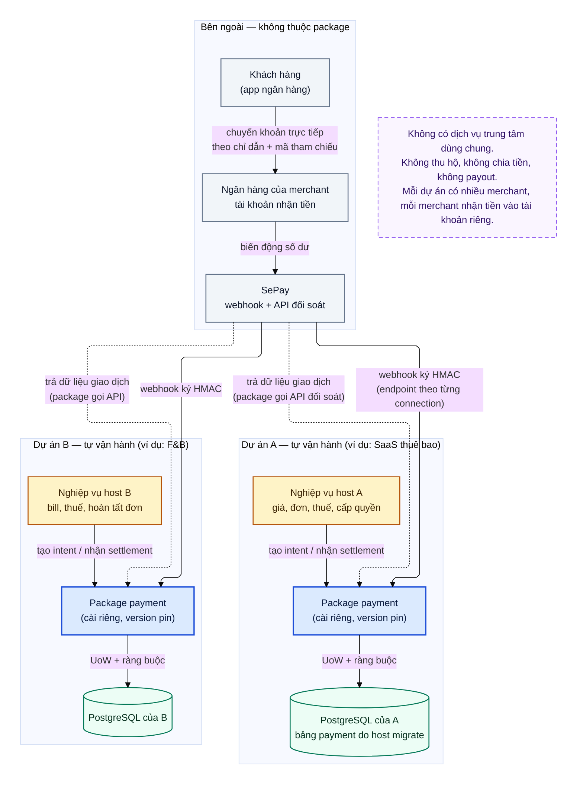

# D01 — Tổng quan kiến trúc

[← Mục lục](../readme.md) · [Danh mục sơ đồ](../diagrams.md)

Trạng thái: sơ đồ kiến trúc đề xuất; không phải bằng chứng triển khai. Nguồn Mermaid được chuyển nguyên từ bản thiết kế đã render/kiểm tra ngày 21/09/2026.

Mỗi dự án cài package riêng, có database riêng và nhận webhook trực tiếp từ SePay. Khách chuyển khoản thẳng vào tài khoản ngân hàng của từng merchant.

- Không có dịch vụ payment trung tâm dùng chung giữa các dự án.
- Package không thu hộ, không chia tiền, không payout — chỉ ghi nhận và đối chiếu tiền đã vào tài khoản merchant.
- Đối soát là package chủ động đọc API giao dịch; mũi tên nét đứt chỉ luồng dữ liệu đọc về.

