# D02 — Component và hướng phụ thuộc

[← Mục lục](../readme.md) · [Danh mục sơ đồ](../diagrams.md)

Trạng thái: sơ đồ kiến trúc đã đối chiếu với các delta đã duyệt (22/09/2026); không phải bằng chứng triển khai. Mermaid đã sửa sau lần render 21/09/2026 và chưa render lại.

Phụ thuộc hướng vào trong: Adapters và Host phụ thuộc Ports/Application; Domain không import framework, ORM hay code của host.

- Host là composition root: đăng ký provider, policy, handler một cách tường minh khi khởi động.
- PaymentReferenceGenerator là port của lõi; checklist mẫu mã SePay là adapter của provider, nên quy tắc riêng của SePay không lọt vào Domain.
- SQLAlchemy/PostgreSQL và FastAPI là extras tuỳ chọn; migration do package cung cấp nhưng host quyết định thời điểm chạy.
- Secret nằm ở secret store của host; bảng payment chỉ giữ tham chiếu.
- Không có `PaymentService` gom mọi dependency: mỗi use case nhận đúng port nó dùng. `build_payment_module(...)` chỉ lắp ghép và trả một container dataclass chứa các use case đã wire, không có method nghiệp vụ.
- `MatchTransaction` là domain service dùng chung cho ProcessInbox, Reconcile và ResolveReview/RematchUnbound, nên webhook, API và operator đi qua cùng chuỗi lõi `InvariantGuard → ReferenceResolver → IntentEligibility → MatchingPolicy → post-check`.

```mermaid
---
config:
  theme: base
  fontFamily: Arial, Helvetica, sans-serif
  layout: elk
  flowchart:
    curve: linear
    nodeSpacing: 55
    rankSpacing: 85
    diagramPadding: 32
    wrappingWidth: 230
  themeVariables:
    fontFamily: "Arial, Helvetica, sans-serif"
    fontSize: 15px
---
flowchart TB
  subgraph HOST["Host project — composition root (ngoài package)"]
    direction LR
    H_BOOT["Bootstrap / DI<br/>đăng ký provider, policy, handler"]
    H_HANDLER["SettlementHandler / OutcomeObserver /<br/>OutboxPublisher của host<br/>cấp quyền / đóng bill"]
    H_MIG["Migration của host<br/>(gọi migration package cung cấp)"]
    H_SECRET["Secret store của host<br/>(tham chiếu, không lưu secret trong bảng payment)"]
  end
  subgraph ADP["Adapters — tuỳ chọn qua extras"]
    direction LR
    AD_API["FastAPI router factory<br/>(tuỳ chọn)"]
    AD_SEPAY["SePayProvider<br/>verify raw body, normalize"]
    AD_READER["SePayTransactionReader<br/>capability đối soát"]
    AD_SQL["SQLAlchemy / PostgreSQL<br/>UoW + repositories"]
    AD_QR["VietQR instruction builder"]
    AD_TPL["SePay template checklist<br/>kiểm mẫu cấp công ty vs profile<br/>(thủ công, không auto-provision)"]
  end
  subgraph APP["Application — mỗi use case một lớp, nhận đúng port"]
    direction LR
    S_BUILD["build_payment_module<br/>container dataclass, không logic"]
    S_INTENT["CreateIntent(prefix_name)<br/>GetIntentStatus"]
    S_INGEST["IngestWebhook"]
    S_PROC["ProcessInbox"]
    S_REC["Reconcile"]
    S_DISP["DispatchOutbox"]
    S_REVIEW["ResolveReview<br/>RematchUnbound"]
    S_ONB["RegisterMerchant / ReceivingAccount /<br/>Connection, BindConnectionAccount,<br/>SetConnectionStatus"]
    S_PROF["CreateReferenceProfile / Activate / Retire<br/>RecordConnectionReadiness"]
    S_REQ["RequeueInbox"]
  end
  subgraph PORTS["Ports — interface nhỏ"]
    direction LR
    P_PROV["PaymentProvider"]
    P_READ["TransactionReader"]
    P_UOW["UnitOfWork + repositories"]
    P_POL["MatchingPolicy"]
    P_CONN["ConnectionResolver"]
    P_SEC["SecretResolver"]
    P_HAND["SettlementHandler"]
    P_REF["PaymentReferenceGenerator"]
    P_TPL["ReferenceTemplateChecklist"]
    P_OBS["OutcomeObserver"]
    P_PUB["OutboxPublisher"]
    P_CLK["Clock"]
  end
  subgraph DOM["Domain — không import framework"]
    direction LR
    D_ENT["Merchant, ReceivingAccount,<br/>PaymentIntent, ProviderObservation,<br/>ProviderTransaction, Settlement, ReviewCase"]
    D_VO["Money (VND nguyên), PaymentReference,<br/>ReferenceProfile (version, nhiều NamedPrefix),<br/>BeneficiarySnapshot"]
    D_MATCH["MatchTransaction (domain service)<br/>InvariantGuard → ReferenceResolver →<br/>IntentEligibility → MatchingPolicy → post-check"]
    D_RULE["Bất biến: amount bất biến,<br/>settle chỉ khi đúng số tiền,<br/>một tiền không phân bổ hai lần"]
  end
  APP --> PORTS
  APP --> DOM
  PORTS --> DOM
  AD_API --> APP
  AD_SEPAY -.->|"implements"| P_PROV
  AD_READER -.->|"implements"| P_READ
  AD_SQL -.->|"implements"| P_UOW
  AD_QR -.->|"dùng bởi"| P_PROV
  H_HANDLER -.->|"implements"| P_HAND
  H_SECRET -.->|"implements"| P_SEC
  AD_TPL -.->|"implements"| P_TPL
  H_BOOT -->|"inject"| APP
  H_MIG -->|"áp dụng schema"| AD_SQL
  S_PROC -->|"dùng"| D_MATCH
  S_REC -->|"dùng"| D_MATCH
  S_REVIEW -->|"dùng"| D_MATCH
  H_HANDLER -.->|"implements (tuỳ chọn)"| P_OBS
  H_HANDLER -.->|"implements (phương án B)"| P_PUB
  classDef dom fill:#dcfce7,stroke:#15803d,color:#052e16,stroke-width:2px;
  classDef port fill:#e0e7ff,stroke:#4338ca,color:#1e1b4b,stroke-width:1.5px;
  classDef app fill:#dbeafe,stroke:#1d4ed8,color:#0b1b3f,stroke-width:1.5px;
  classDef adp fill:#f1f5f9,stroke:#475569,color:#0f172a,stroke-width:1.5px;
  classDef host fill:#fef3c7,stroke:#b45309,color:#3b2303,stroke-width:1.5px;
  class D_ENT,D_VO,D_MATCH,D_RULE dom;
  class P_PROV,P_READ,P_UOW,P_POL,P_CONN,P_SEC,P_HAND,P_REF,P_TPL,P_OBS,P_PUB,P_CLK port;
  class S_BUILD,S_INTENT,S_INGEST,S_PROC,S_REC,S_DISP,S_REVIEW,S_ONB,S_PROF,S_REQ app;
  class AD_API,AD_SEPAY,AD_READER,AD_SQL,AD_QR,AD_TPL adp;
  class H_BOOT,H_HANDLER,H_MIG,H_SECRET host;
```

