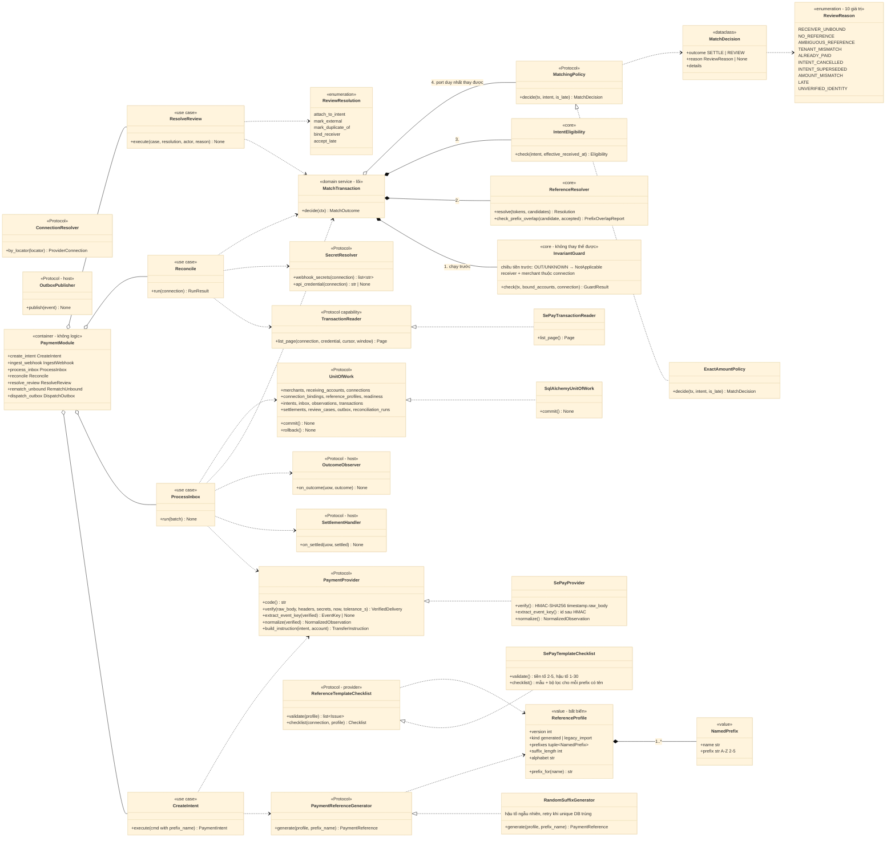

# D03 — Ports và lớp OOP

[← Mục lục](../readme.md) · [Danh mục sơ đồ](../diagrams.md)

Trạng thái: sơ đồ kiến trúc đã đối chiếu với các delta đã duyệt (22/09/2026); không phải bằng chứng triển khai. Mermaid đã sửa sau lần render 21/09/2026 và chưa render lại.

Interface nhỏ (Protocol) với implementation thay thế được. Không có lớp `PaymentService` gom mọi port: mỗi use case nhận đúng port nó dùng, `build_payment_module` chỉ lắp ghép (container dataclass, không logic). Không dùng chuỗi kế thừa theo dự án/merchant.

- `MatchTransaction` là domain service dùng chung cho ProcessInbox, Reconcile và ResolveReview/RematchUnbound. Chuỗi lõi không thay được: `InvariantGuard` (chiều tiền trước, rồi receiver/merchant) → `ReferenceResolver` (khớp nguyên token) → `IntentEligibility` (policy không bao giờ thấy intent `paid/cancelled/superseded`) → `MatchingPolicy` (port duy nhất host thay được) → post-check của lõi.
- Policy chỉ được **thắt chặt**: post-check từ chối `SETTLE` khi số tiền khác intent hoặc late (`PolicyViolation`). U9: không có `accepted_variance`, không có đường operator settle lệch tiền.
- `MatchDecision` là dataclass `{outcome: SETTLE | REVIEW, reason: ReviewReason | None, details}`. `ReviewReason` có đúng **10** giá trị; `TENANT_MISMATCH` (D6) là lý do thứ 10 — alert + mở review + metric, `candidate_intent_id = NULL`. `UNVERIFIED_IDENTITY` do Reconcile đặt, không phải policy.
- `ReferenceProfile` có nhiều `NamedPrefix` (D1) dùng chung `suffix_length`/`alphabet`; `CreateIntent` nhận **tên prefix**, tên lạ → `UnknownReferencePrefix`. Kiểm trùng/lồng nhau là lỗi trong một version, chỉ advisory giữa các version.
- `PaymentProvider.extract_event_key` chỉ đọc `id` sau HMAC; thiếu id → inbox `quarantined` với khoá `sha256(raw_body)`.
- TransactionReader là capability riêng: provider không có API đối soát vẫn dùng được phần còn lại. SettlementHandler/OutcomeObserver do host implement, chạy cùng UoW; OutboxPublisher cho phương án B.

