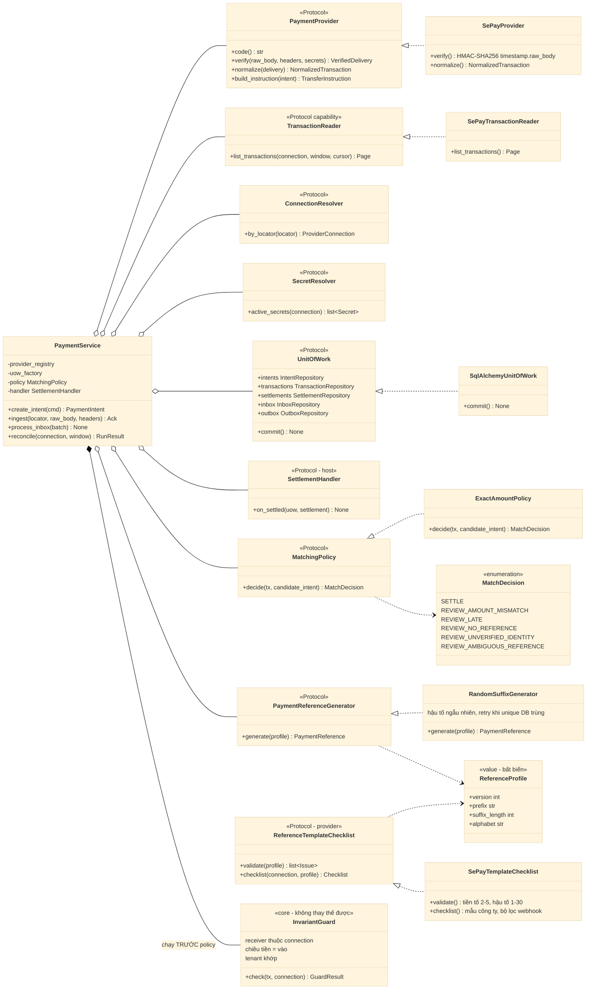

# D03 — Ports và lớp OOP

[← Mục lục](../readme.md) · [Danh mục sơ đồ](../diagrams.md)

Trạng thái: sơ đồ kiến trúc đề xuất; không phải bằng chứng triển khai. Nguồn Mermaid được chuyển nguyên từ bản thiết kế đã render/kiểm tra ngày 21/09/2026.

Interface nhỏ (Protocol) với implementation thay thế được. PaymentService ghép các port bằng composition, không dùng chuỗi kế thừa theo dự án/merchant.

- InvariantGuard thuộc lõi và luôn chạy trước MatchingPolicy: receiver phải thuộc connection, tiền phải là tiền vào, tenant phải khớp. Policy tuỳ biến không thể nới các điều kiện này.
- TransactionReader là capability riêng: provider không có API đối soát vẫn dùng được phần còn lại.
- MatchingPolicy chỉ quyết định khớp hay review; không bỏ qua được bước xác thực hay chống trùng.
- PaymentReferenceGenerator sinh mã từ ReferenceProfile bất biến; RandomSuffixGenerator là strategy mặc định. ReferenceTemplateChecklist (adapter SePay) chỉ kiểm tra và liệt kê việc cần làm, không tự cấu hình SePay.
- REVIEW_AMBIGUOUS_REFERENCE: không có hoặc có nhiều ứng viên mâu thuẫn thì vào review, không đoán.
- SettlementHandler do host implement; lõi không biết gói, bill hay quyền lợi của host.

