# D04 — Mô hình thực thể (ER)

[← Mục lục](../readme.md) · [Danh mục sơ đồ](../diagrams.md)

Trạng thái: sơ đồ kiến trúc đã đối chiếu với các delta đã duyệt (22/09/2026); vẫn là thiết kế, không phải bằng chứng triển khai. Hình dạng cột và ràng buộc là hợp đồng cho `schema_v1`; ma trận ràng buộc đầy đủ nằm ở [data-model.md](../data-model.md#ma-trận-sở-hữu-ràng-buộc-và-test).

Mọi bảng dữ liệu mang `tenant_id`, trừ cấu hình cấp project (`REFERENCE_PROFILE`, `REFERENCE_PROFILE_PREFIX`). Intent bất biến về merchant, tài khoản thụ hưởng và số tiền. **Quan sát** (mỗi bản tin webhook hoặc dòng API là một `PROVIDER_OBSERVATION`) tách khỏi **fact tiền** (mỗi khoản tiền là một `PROVIDER_TRANSACTION` canonical). `SETTLEMENT` là cầu nối duy nhất giữa tiền và intent.

- **Một chủ sở hữu mỗi environment (quyết định người dùng 22/09/2026):** một tài khoản ngân hàng/VA thuộc đúng một `tenant + merchant` trong mỗi environment (Test/Live) của một bản cài. DB bảo đảm bằng `UQ(environment, account_fingerprint)` trên `RECEIVING_ACCOUNT` (không scope theo tenant) cộng composite FK mang `tenant_id + merchant_id + environment` ở binding, intent, fact và settlement.
- `dedup_key` dựa trên định danh tài khoản **do payload báo về** (`provider_account_key`, không phải FK đã resolve) cộng loại và giá trị định danh nguồn, unique trong `UQ(tenant_id, environment, dedup_key)` (không unique toàn cục: cùng id + tài khoản ở Test và Live, hoặc ở hai tenant, là hai fact). Xoay credential hay tạo lại connection không sinh bản ghi tiền mới; fact của tài khoản chưa bind vẫn dedup đúng.
- ID số webhook và UUID API v2 là hai không gian ID khác nhau (`webhook_tx_id`, `api_tx_id` là hai cột, mỗi cột partial unique trong scope). Cầu nối hai nguồn là mã tham chiếu ngân hàng (`bank_reference`), chỉ có index thường, không unique; chỉ link khi đủ bằng chứng.
- `SETTLEMENT` không có `variance_vnd` (U9: v1 không nhận thiếu/thừa tiền). `CHECK (amount_vnd = intent_amount_vnd)` và hai composite FK cùng `tenant + environment + receiving_account + số tiền` tới transaction và intent làm DB tự chặn sai tiền, sai receiver, chéo tenant/merchant/environment với **mọi** origin.
- `REFERENCE_PROFILE` thuộc project; mỗi version có **nhiều prefix có tên** (`REFERENCE_PROFILE_PREFIX`, D1) dùng chung `suffix_length` và `alphabet`. Intent snapshot `payment_reference`, `reference_profile_version` và `reference_prefix_name`, không bao giờ rewrite.
- Fact có `CHECK ((merchant_id IS NULL) = (receiving_account_id IS NULL))` để FK receiver (MATCH SIMPLE) không bị bỏ qua khi một cột NULL. Observation, readiness và review case mang `environment` được ghim bằng composite FK tới connection/fact.
- Các nhãn UK/FK trên sơ đồ là ý đồ ràng buộc; trong schema thật chúng là composite như ghi trong ngoặc kép. Danh sách đích unique của mọi composite FK nằm ở [data-model.md](../data-model.md#ma-trận-sở-hữu-ràng-buộc-và-test).

```mermaid
---
config:
  theme: base
  fontFamily: Arial, Helvetica, sans-serif
  themeVariables:
    fontFamily: "Arial, Helvetica, sans-serif"
    fontSize: 15px
---
erDiagram
  REFERENCE_PROFILE ||--o{ REFERENCE_PROFILE_PREFIX : "nhiều prefix có tên"
  REFERENCE_PROFILE ||--o{ PAYMENT_INTENT : "snapshot version"
  REFERENCE_PROFILE_PREFIX |o--o{ PAYMENT_INTENT : "prefix_name (NULL khi legacy)"
  REFERENCE_PROFILE ||--o{ CONNECTION_REFERENCE_READINESS : "áp dụng"
  PROVIDER_CONNECTION ||--o{ CONNECTION_REFERENCE_READINESS : "checklist theo environment"
  MERCHANT ||--o{ PROVIDER_CONNECTION : "có"
  MERCHANT ||--o{ RECEIVING_ACCOUNT : "sở hữu (1 owner / environment)"
  PROVIDER_CONNECTION ||--o{ CONNECTION_ACCOUNT_BINDING : "theo dõi"
  RECEIVING_ACCOUNT ||--o{ CONNECTION_ACCOUNT_BINDING : "được bind"
  MERCHANT ||--o{ PAYMENT_INTENT : "thu tiền"
  RECEIVING_ACCOUNT ||--o{ PAYMENT_INTENT : "snapshot người thụ hưởng"
  PAYMENT_INTENT |o--o| PAYMENT_INTENT : "superseded_by"
  PROVIDER_CONNECTION ||--o{ WEBHOOK_INBOX : "nhận qua locator"
  PROVIDER_CONNECTION ||--o{ RECONCILIATION_RUN : "đối soát"
  PROVIDER_CONNECTION ||--o{ PROVIDER_OBSERVATION : "quan sát"
  WEBHOOK_INBOX ||--o| PROVIDER_OBSERVATION : "source=webhook"
  RECONCILIATION_RUN ||--o{ PROVIDER_OBSERVATION : "source=api"
  PROVIDER_TRANSACTION |o--o{ PROVIDER_OBSERVATION : "provenance (link)"
  RECEIVING_ACCOUNT |o--o{ PROVIDER_TRANSACTION : "resolve; NULL khi chưa bind"
  PROVIDER_TRANSACTION |o--o| PROVIDER_TRANSACTION : "duplicate_of"
  PROVIDER_TRANSACTION ||--o| SETTLEMENT : "phân bổ 1-1"
  PAYMENT_INTENT ||--o| SETTLEMENT : "tất toán"
  PROVIDER_TRANSACTION ||--o{ REVIEW_CASE : "cần xem xét"
  PAYMENT_INTENT |o--o{ REVIEW_CASE : "candidate (cùng tenant)"
  REVIEW_CASE |o--o| SETTLEMENT : "provenance operator"
  SETTLEMENT ||--o{ OUTBOX_EVENT : "phát sự kiện"
  REVIEW_CASE ||--o{ OUTBOX_EVENT : "phát sự kiện"

  REFERENCE_PROFILE {
    int version PK "bất biến sau khi dùng; cấp project"
    string kind "generated, legacy_import"
    int suffix_length "chung mọi prefix; 1-30; NULL khi legacy"
    string alphabet "chung; A-Z0-9 hoặc 0-9; NULL khi legacy"
    string status "draft, active, accepted_legacy, retired"
    string partial_unique "UQ(status) WHERE status=active"
    timestamptz activated_at
    string activated_by
  }
  REFERENCE_PROFILE_PREFIX {
    int profile_version PK,FK
    string name PK "vd subscription, topup"
    string prefix "A-Z 2-5; UQ(profile_version, prefix)"
  }
  CONNECTION_REFERENCE_READINESS {
    uuid id PK
    string tenant_id
    uuid connection_id FK "FK(tenant_id, environment, connection_id)"
    int profile_version FK
    string environment "= environment của connection (composite FK)"
    string status "pending, ready, retired"
    json checklist "mẫu + bộ lọc cho mỗi prefix có tên"
    string evidence_ref
    string verified_by "xác minh thủ công"
    timestamptz verified_at
  }
  MERCHANT {
    uuid id PK "UQ(tenant_id, id)"
    string tenant_id "scope do host cấp"
    string host_merchant_ref "UQ(tenant_id, host_merchant_ref)"
    string status
  }
  RECEIVING_ACCOUNT {
    uuid id PK "UQ(tenant_id, merchant_id, environment, id)"
    string tenant_id
    uuid merchant_id FK "FK(tenant_id, merchant_id)"
    string environment "test, live"
    string bank_code
    string bank_bin
    string account_number "đầy đủ, được bảo vệ"
    string sub_account "VA; rỗng nếu không có"
    string account_number_masked "chỉ hiển thị"
    string account_fingerprint UK "BANK|ACCOUNT|SUB; UQ(environment, account_fingerprint)"
    string provider_account_ref "bank_account_id SePay, NULL"
    string holder_name
    string status
  }
  PROVIDER_CONNECTION {
    uuid id PK "UQ(tenant_id, merchant_id, environment, id); UQ(tenant_id, environment, id); UQ(tenant_id, id)"
    string tenant_id
    uuid merchant_id FK "FK(tenant_id, merchant_id)"
    string environment "test, live"
    string provider "sepay"
    string locator UK "128-bit ngẫu nhiên, chỉ định tuyến"
    string secret_ref "HMAC webhook; env: hoặc vault:"
    string api_credential_ref "token API cấp company, NULL"
    string auth_mode "HMAC bắt buộc"
    string reconcile_mode "detect_only mặc định, auto_settle"
    string reconcile_evidence_ref "bắt buộc khi auto_settle"
    int timestamp_tolerance_seconds "mặc định 300; 60-7200"
    string status "pending, active, not_ready, disabled"
  }
  CONNECTION_ACCOUNT_BINDING {
    uuid connection_id PK,FK "FK(tenant, merchant, env, connection)"
    uuid receiving_account_id PK,FK "FK(tenant, merchant, env, account)"
    string tenant_id
    uuid merchant_id "buộc connection và account cùng merchant"
    string environment "buộc cùng environment"
    string created_by
  }
  PAYMENT_INTENT {
    uuid id PK "UQ(tenant_id, environment, id, receiving_account_id, amount_vnd)"
    string tenant_id
    uuid merchant_id FK "bất biến"
    string environment "lấy từ connection, không từ client"
    uuid receiving_account_id FK "FK(tenant, merchant, env, account)"
    bigint amount_vnd "bất biến; CHECK > 0"
    string currency "VND"
    json beneficiary_snapshot "bất biến"
    string payment_reference UK "unique toàn project; khớp nguyên token"
    int reference_profile_version FK "snapshot, không rewrite"
    string reference_prefix_name FK "FK(version, name); NULL khi legacy"
    string host_ref_type
    string host_ref_id
    string idempotency_key UK "UQ(tenant_id, environment, idempotency_key)"
    string request_fingerprint
    timestamptz expires_at
    string status "awaiting_payment, paid, expired, cancelled, superseded"
    uuid superseded_by_intent_id FK "self-FK(tenant, merchant, env, id), NULL"
  }
  WEBHOOK_INBOX {
    uuid id PK "UQ(tenant_id, connection_id, id)"
    string tenant_id
    uuid connection_id FK "FK(tenant_id, connection_id)"
    string event_key UK "UQ(connection_id, event_key); webhook:id hoặc sha256:hash"
    string event_key_kind "provider_id, body_hash"
    string body_sha256 "NOT NULL"
    bytes raw_body "PII; hạn chế truy cập; purge được"
    timestamptz received_at "nguồn thời gian late của webhook"
    string status "received, processing, processed, retry_wait, failed, quarantined"
    int attempts
    timestamptz next_attempt_at
    string lease_owner
    bigint lease_generation "tăng mỗi lần claim; CAS khi finalize"
    timestamptz lease_until
    string last_error_code
    timestamptz purge_after
  }
  RECONCILIATION_RUN {
    uuid id PK "UQ(tenant_id, connection_id, id)"
    string tenant_id
    uuid connection_id FK "FK(tenant_id, connection_id)"
    timestamptz window_from
    timestamptz window_to
    string cursor "since_id cuối đã xử lý bền"
    string status
    json counts "linked, unlinked, ambiguous, new, review"
  }
  PROVIDER_OBSERVATION {
    uuid id PK
    string tenant_id
    string environment "NOT NULL; = environment của connection"
    uuid connection_id FK "FK(tenant_id, environment, connection_id)"
    string provider
    string source "webhook, api"
    string source_tx_id "UQ(provider, source, source_tx_id, connection_id)"
    uuid inbox_id FK "FK(tenant_id, connection_id, inbox_id); bắt buộc khi webhook"
    uuid reconciliation_run_id FK "FK(tenant_id, connection_id, run_id); bắt buộc khi api"
    string reported_account_key "đầy đủ, do payload báo"
    string bank_reference "referenceCode / reference_number"
    bigint amount_vnd
    string direction "in, out, unknown"
    timestamptz occurred_at "chỉ tin khi kịch bản SePay Test xác minh"
    timestamptz observed_at
    uuid transaction_id FK "FK(tenant, env, provider, reported_account_key, tx); NULL tới khi link"
    string link_method "same_source_id, bank_reference, operator"
    string link_status "linked, unlinked, ambiguous"
  }
  PROVIDER_TRANSACTION {
    uuid id PK "UQ(tenant_id, environment, id, receiving_account_id, amount_vnd); UQ(tenant_id, environment, id); UQ(tenant_id, environment, provider, provider_account_key, id)"
    string tenant_id
    uuid merchant_id "NULL tới khi resolve; CHECK cùng NULL với receiving_account_id"
    string environment "từ connection"
    string provider
    string provider_account_key "NOT NULL; do payload báo; BANK|ACCOUNT|SUB"
    uuid receiving_account_id FK "FK(tenant, merchant, env, account); NULL khi RECEIVER_UNBOUND"
    string identity_kind "webhook_id, api_id"
    string identity_value
    string dedup_key "provider|account_key|identity_kind|identity_value; UQ(tenant_id, environment, dedup_key)"
    string webhook_tx_id "partial UQ trong scope tenant+env+provider+account"
    string api_tx_id "partial UQ trong scope tenant+env+provider+account"
    string bank_reference "index thường, không unique"
    bigint amount_vnd "NOT NULL; CHECK >= 0"
    string direction "in, out, unknown"
    string memo
    string first_source "webhook, reconcile"
    string match_state "recorded, settled, in_review, not_applicable, closed_external, duplicate_of"
    uuid duplicate_of_transaction_id FK "self-FK cùng scope"
  }
  SETTLEMENT {
    uuid id PK
    string tenant_id
    string environment
    uuid transaction_id FK,UK "FK(tenant, env, tx, account, amount_vnd)"
    uuid intent_id FK,UK "FK(tenant, env, intent, account, intent_amount_vnd)"
    uuid receiving_account_id "NOT NULL"
    bigint amount_vnd "NOT NULL; = tiền thực nhận"
    bigint intent_amount_vnd "NOT NULL; CHECK amount_vnd = intent_amount_vnd"
    string origin "auto, operator_review"
    uuid review_case_id FK "FK(review_case_id, tenant_id, transaction_id); bắt buộc khi operator_review"
    string resolved_by "bắt buộc khi operator_review"
    timestamptz settled_at
  }
  REVIEW_CASE {
    uuid id PK "UQ(id, tenant_id, transaction_id)"
    string tenant_id
    string environment "NOT NULL; = environment của fact"
    uuid transaction_id FK "FK(tenant, env, tx); partial UQ WHERE status=open"
    uuid candidate_intent_id FK "FK(tenant, env, candidate_intent_id), NULL"
    string reason "ReviewReason: 10 giá trị"
    json details
    string status "open, resolved"
    string resolution "ReviewResolution"
    string resolution_ref
    string resolved_by
  }
  OUTBOX_EVENT {
    uuid event_id PK
    string tenant_id
    string type "PaymentSettled, PaymentNeedsReview, ReviewResolved"
    int schema_version "NOT NULL"
    string aggregate_type
    uuid aggregate_id
    json payload
    json trusted_scope "tenant_id, merchant_id"
    string status "pending, published, failed"
    int attempts
    string lease_owner
    bigint lease_generation
    timestamptz available_at
    timestamptz next_attempt_at
    timestamptz published_at
  }
```

Không còn quan hệ 1-1 connection → account: `CONNECTION_ACCOUNT_BINDING` cho phép một connection (một webhook SePay) theo dõi nhiều tài khoản/VA của **cùng merchant và cùng environment**. Receiver lệch không làm mất fact: fact được ghi với `receiving_account_id NULL` và mở review `RECEIVER_UNBOUND`.
