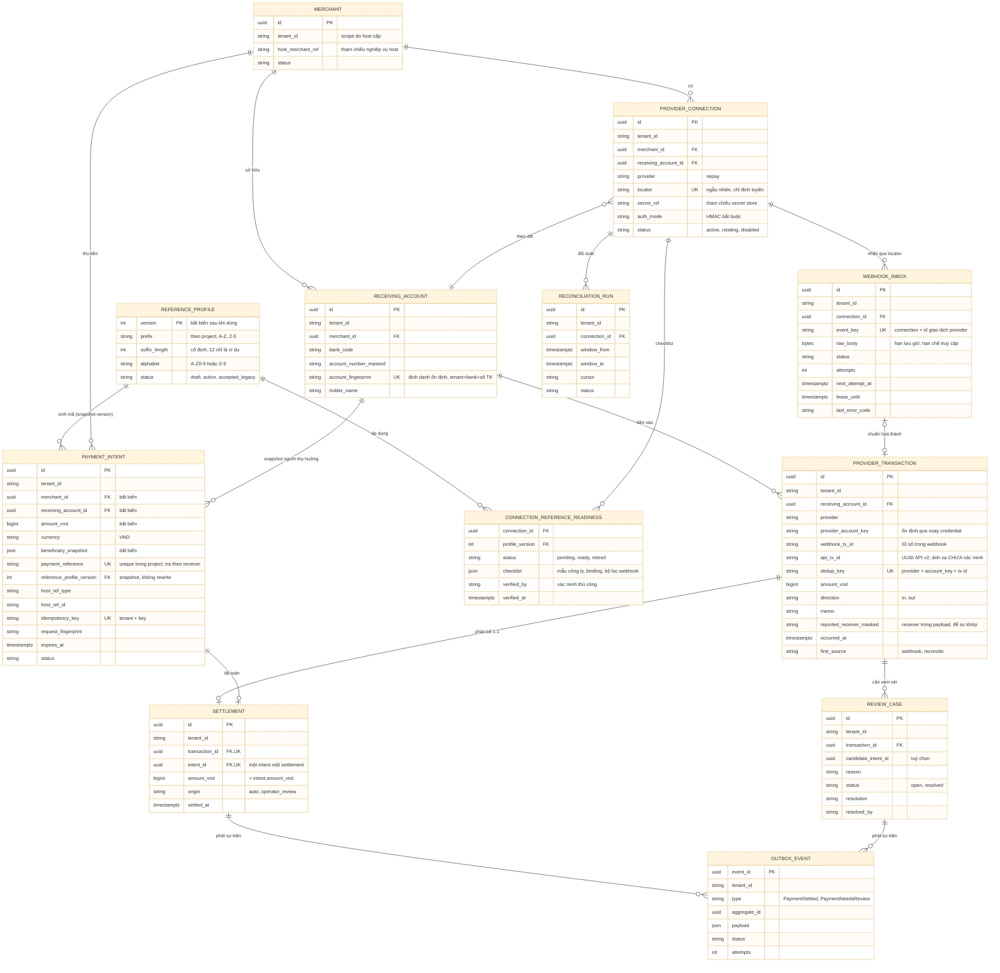

# D04 — Mô hình thực thể (ER)

[← Mục lục](../readme.md) · [Danh mục sơ đồ](../diagrams.md)

Trạng thái: sơ đồ kiến trúc đề xuất; không phải bằng chứng triển khai. Nguồn Mermaid được chuyển nguyên từ bản thiết kế đã render/kiểm tra ngày 21/09/2026.

Mọi bảng mang tenant_id. Intent bất biến về merchant, tài khoản thụ hưởng và số tiền; fact ngân hàng tách khỏi kết quả matching; Settlement là cầu nối duy nhất giữa tiền và intent.

- dedup_key dựa trên định danh tài khoản ổn định (provider_account_key), không dựa vào connection — xoay credential hay tạo lại connection không sinh bản ghi tiền mới.
- webhook_tx_id và api_tx_id là hai cột riêng; ánh xạ giữa chúng CHƯA xác minh.
- Unique trên Settlement.transaction_id và Settlement.intent_id thể hiện mặc định 1 giao dịch ↔ 1 intent đúng tiền.
- REFERENCE_PROFILE thuộc project (mỗi project một database). Intent snapshot reference và profile_version, không bao giờ rewrite. CONNECTION_REFERENCE_READINESS lưu checklist onboarding và bằng chứng xác minh thủ công của từng connection.
- Các unique ghi trên sơ đồ là ý đồ ràng buộc; trong schema thật chúng là composite có tenant_id.

