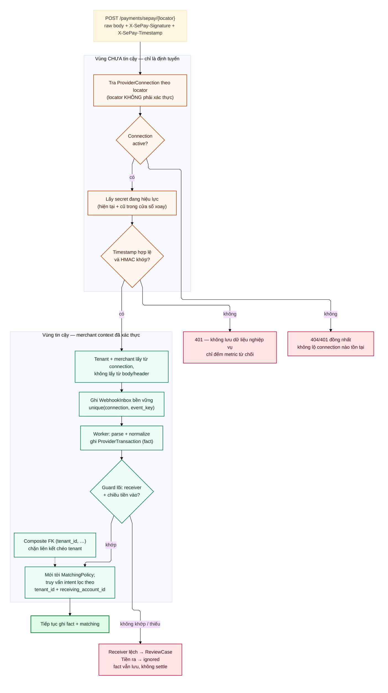

# D05 — Ranh giới tin cậy multi-merchant

[← Mục lục](../readme.md) · [Danh mục sơ đồ](../diagrams.md)

Trạng thái: sơ đồ kiến trúc đề xuất; không phải bằng chứng triển khai. Nguồn Mermaid được chuyển nguyên từ bản thiết kế đã render/kiểm tra ngày 21/09/2026.

Locator trên URL chỉ để tìm connection. Merchant context chỉ được tin sau khi HMAC trên raw body hợp lệ với secret của chính connection đó.

- Không đọc tenant/merchant từ body hay header do bên gửi tự khai.
- Phản hồi đồng nhất khi connection không tồn tại, để không lộ connection nào có thật.
- Guard lõi chạy trước policy: receiver lệch → fact vẫn lưu, mở ReviewCase; tiền ra → ignored. Cả hai đều không settle.

