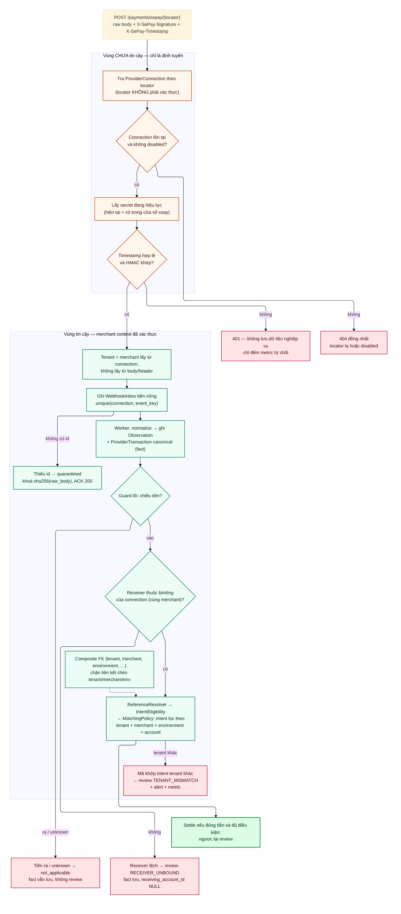

# D05 — Ranh giới tin cậy multi-merchant

[← Mục lục](../readme.md) · [Danh mục sơ đồ](../diagrams.md)

Trạng thái: sơ đồ kiến trúc đã đối chiếu với các delta đã duyệt (22/09/2026); không phải bằng chứng triển khai. Mermaid đã sửa sau lần render 21/09/2026 và chưa render lại.

Locator trên URL chỉ để tìm connection. Merchant context chỉ được tin sau khi HMAC trên raw body hợp lệ với secret của chính connection đó.

- Không đọc tenant/merchant từ body hay header do bên gửi tự khai.
- Locator không tồn tại hoặc connection `disabled` → **404 đồng nhất** (D5), không lộ connection nào có thật. Chữ ký hoặc timestamp sai → 401. Connection `pending`/`not_ready` vẫn nhận và lưu webhook đã xác thực (tiền thật không bị bỏ), chỉ không nhận intent mới.
- Ingest chỉ đọc trường `id` sau HMAC; thiếu id → inbox `quarantined` với khoá `sha256(raw_body)`, vẫn ACK 200.
- Guard lõi chạy trước policy và xét **chiều tiền trước**: tiền ra/`unknown` → fact vẫn lưu, `not_applicable`, không review. Tiền vào có receiver không thuộc binding → fact lưu với `receiving_account_id NULL`, review `RECEIVER_UNBOUND`. Mã khớp intent của tenant khác → review `TENANT_MISMATCH` + alert + metric (D6). Không nhánh nào settle.
- Merchant của connection, receiving account và intent phải trùng nhau (cùng tenant chưa đủ); environment Test/Live cũng nằm trong composite FK.

