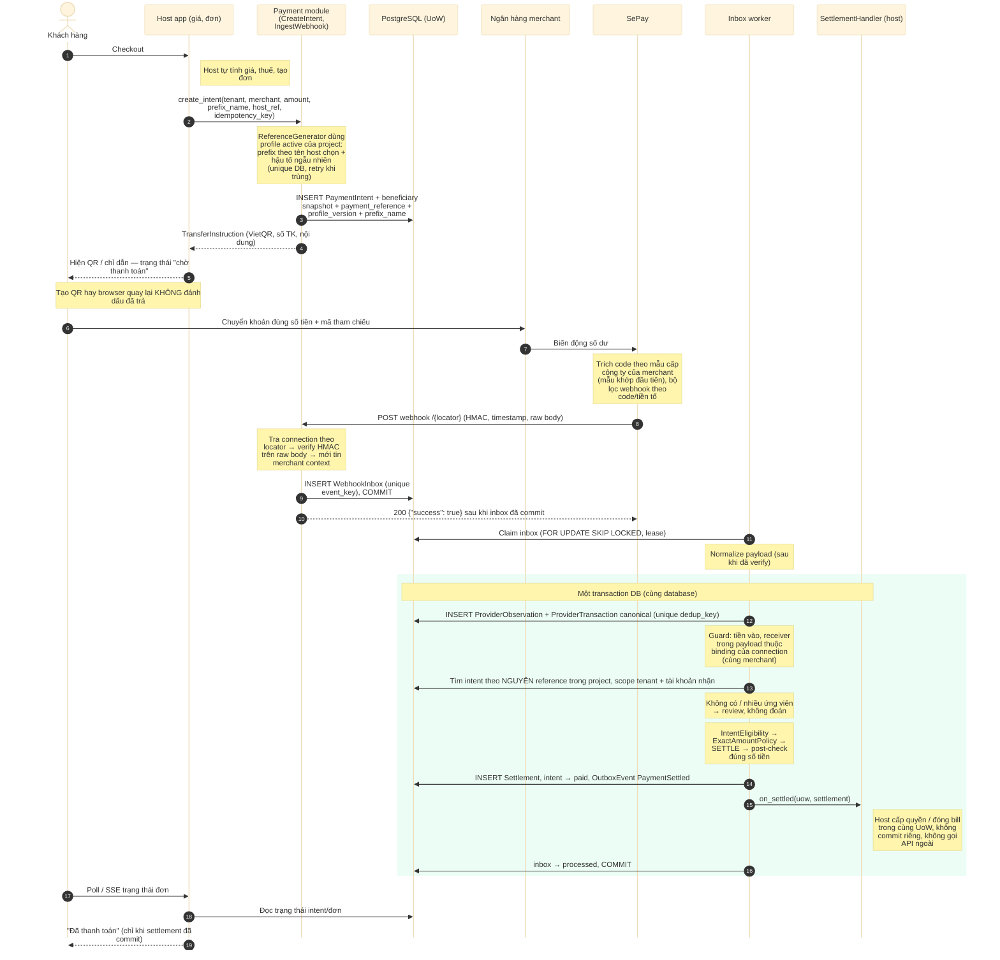

# D06 — Sequence: thanh toán thành công

[← Mục lục](../readme.md) · [Danh mục sơ đồ](../diagrams.md)

Trạng thái: sơ đồ kiến trúc đề xuất; không phải bằng chứng triển khai. Mermaid đã sửa tên participant và bước fact sau lần render 21/09/2026, chưa render lại.

Từ checkout tới khi host hiển thị “Đã thanh toán”. ACK cho SePay chỉ sau khi inbox đã commit; tiền, trạng thái intent, outbox và (nếu chọn) quyền lợi của host commit cùng một transaction.

- Mã tham chiếu sinh từ profile đang active của project. SePay trích code theo mẫu cấp công ty của merchant; server vẫn khớp nguyên reference sau HMAC, receiver và dedup.
- Tạo QR hay browser quay lại không bao giờ đổi trạng thái sang đã trả.
- Worker xử lý tách khỏi request webhook, nên ACK không phụ thuộc thời gian xử lý nghiệp vụ.
- Bước on_settled chỉ áp dụng cho phương án handler cùng UoW (xem D12).

