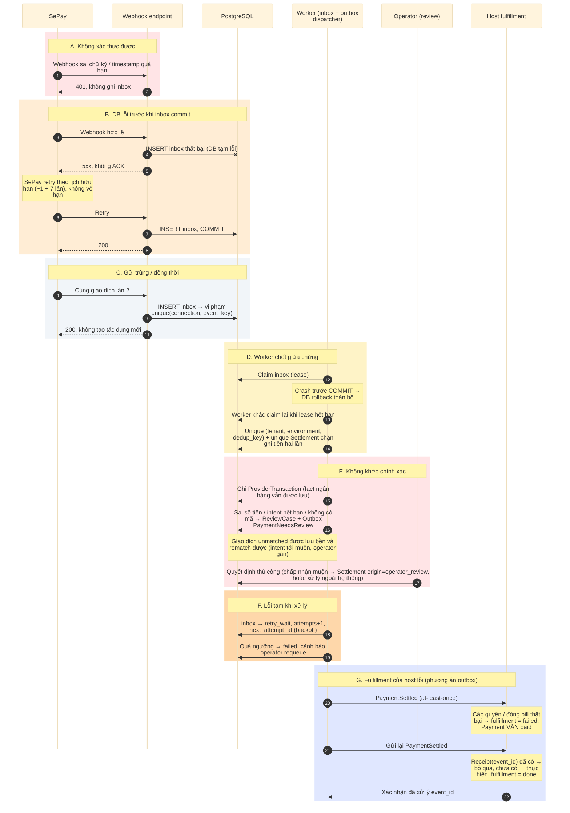

# D07 — Sequence: lỗi, trùng và retry

[← Mục lục](../readme.md) · [Danh mục sơ đồ](../diagrams.md)

Trạng thái: sơ đồ kiến trúc đề xuất; không phải bằng chứng triển khai. Mermaid đã sửa phạm vi dedup sau lần render 21/09/2026, chưa render lại.

Bảy tình huống: sai chữ ký, DB lỗi trước khi inbox commit, gửi trùng, worker chết, không khớp chính xác, lỗi tạm khi xử lý, và fulfillment của host lỗi.

- Retry của SePay là hữu hạn; hệ thống không được dựa vào retry vô hạn.
- Ràng buộc unique trong DB — không phải lock trong bộ nhớ — chặn ghi tiền hai lần.
- Lệch tiền hay trả muộn không bao giờ tự settle: ghi fact, mở ReviewCase, phát NeedsReview. Giao dịch unmatched được lưu bền và rematch được.
- Fulfillment của host lỗi không đảo trạng thái paid; host retry idempotent theo event_id.

