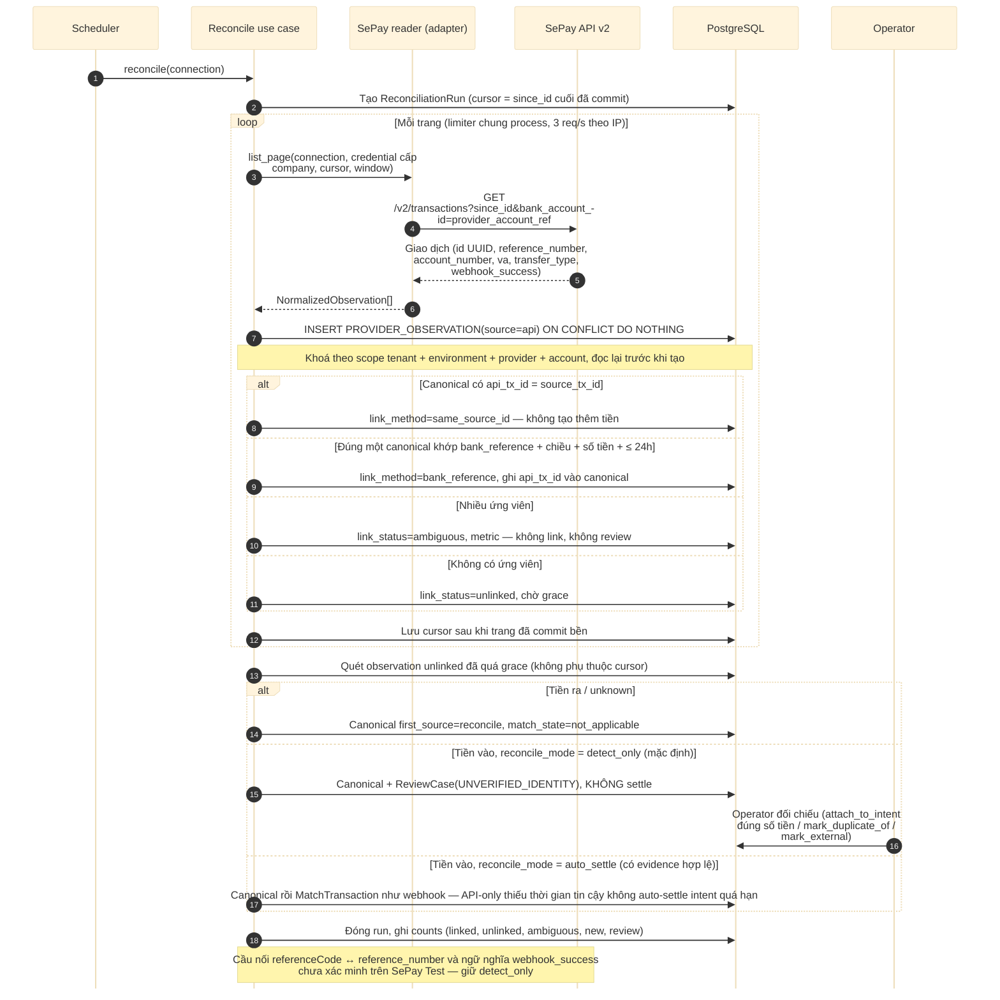

# D08 — Sequence: đối soát qua API

[← Mục lục](../readme.md) · [Danh mục sơ đồ](../diagrams.md)

Trạng thái: sơ đồ kiến trúc đã đối chiếu với các delta đã duyệt (22/09/2026); không phải bằng chứng triển khai. Mermaid đã sửa sau lần render 21/09/2026 và chưa render lại.

Bù webhook bị lỡ bằng cursor `since_id` (cửa sổ ngày có chồng lấn chỉ để chạy lại). Mỗi dòng API là một `PROVIDER_OBSERVATION`; observation được **link** vào fact canonical đã có hoặc, sau grace, tạo canonical mới. Không bao giờ gộp hai khoản tiền khi bằng chứng chưa đủ.

- ID số webhook và UUID API v2 là hai không gian ID khác nhau. Cầu nối là mã tham chiếu ngân hàng (`referenceCode` webhook = `reference_number` API, S4 khuyến nghị) — **chưa xác minh trên SePay Test**, nên mặc định `reconcile_mode = detect_only`.
- Luật link (theo thứ tự): (1) canonical có `api_tx_id = source_tx_id` → `same_source_id`; (2) đúng **một** canonical cùng scope `tenant + environment + provider + provider_account_key`, `bank_reference` bằng nhau (trim/upper, không rỗng), cùng chiều, cùng số tiền, lệch thời gian ≤ 24h → `bank_reference`; nhiều ứng viên → `ambiguous` (metric, không link, không review); (3) không link được → `unlinked`.
- Link-or-create chạy dưới khoá theo scope (hoặc SERIALIZABLE có retry giới hạn) và đọc lại trước khi tạo, để webhook và API đến đồng thời chỉ tạo **một** canonical.
- Observation `unlinked` được lưu bền và **quét lại sau grace** (mặc định 60 phút ≥ lịch retry ~33 phút của SePay) dù cursor đã tiến. `webhook_success = 1` mà không có webhook → alert cấu hình (locator/bộ lọc), không review theo giao dịch.
- Quá grace, tiền vào: `detect_only` → canonical `first_source=reconcile`, review `UNVERIFIED_IDENTITY`, không settle; `auto_settle` (chỉ bật khi `reconcile_evidence_ref` có bằng chứng hợp lệ) → chạy `MatchTransaction` như webhook. API fact tiền ra/unknown → `not_applicable`, không review. API-only không có thời gian provider đã xác minh thì không auto-settle intent đã quá hạn.
- Reader lọc `bank_account_id = provider_account_ref`, dùng credential API cấp company (`api_credential_ref`) và một limiter chung process (rate limit 3 req/s theo IP), round-robin giữa connection. Cursor chỉ lưu sau khi xử lý trang đã commit bền. Chạy lại một cửa sổ là idempotent.

