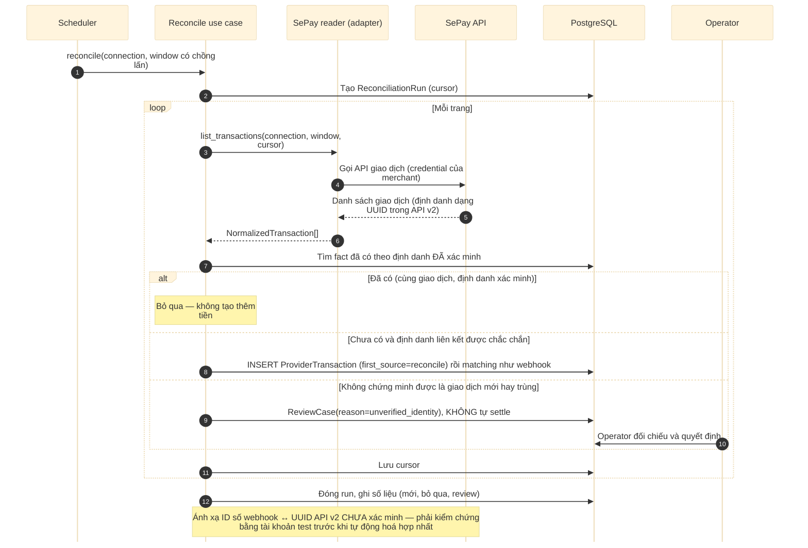

# D08 — Sequence: đối soát qua API

[← Mục lục](../readme.md) · [Danh mục sơ đồ](../diagrams.md)

Trạng thái: sơ đồ kiến trúc đề xuất; không phải bằng chứng triển khai. Nguồn Mermaid được chuyển nguyên từ bản thiết kế đã render/kiểm tra ngày 21/09/2026.

Bù webhook bị lỡ bằng cửa sổ thời gian có chồng lấn và cursor. Giao dịch không chứng minh được là mới hay trùng thì vào review thay vì tự settle.

- Webhook dùng ID số; API v2 dùng UUID — cần kiểm chứng bằng tài khoản test trước khi tự động hợp nhất.
- Chạy lại một cửa sổ đã đối soát phải an toàn (idempotent).

