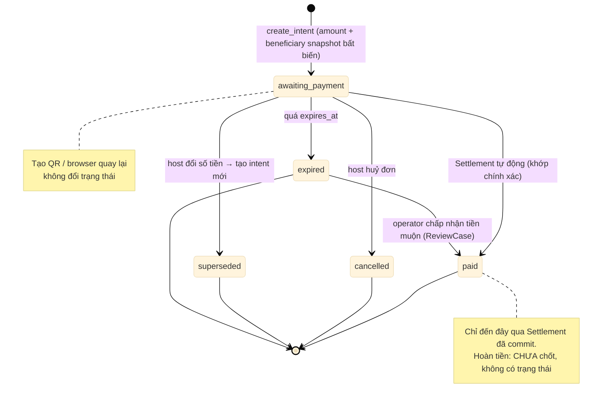

# D09 — Vòng đời PaymentIntent

[← Mục lục](../readme.md) · [Danh mục sơ đồ](../diagrams.md)

Trạng thái: sơ đồ kiến trúc đề xuất; không phải bằng chứng triển khai. Nguồn Mermaid được chuyển nguyên từ bản thiết kế đã render/kiểm tra ngày 21/09/2026.

Intent chỉ tới paid qua Settlement đã commit. Đổi số tiền tạo intent mới; intent cũ superseded.

- Chấp nhận tiền muộn là quyết định của operator qua ReviewCase, không tự động.
- Hoàn tiền và thanh toán một phần chưa được chốt nên không có trạng thái tương ứng.

