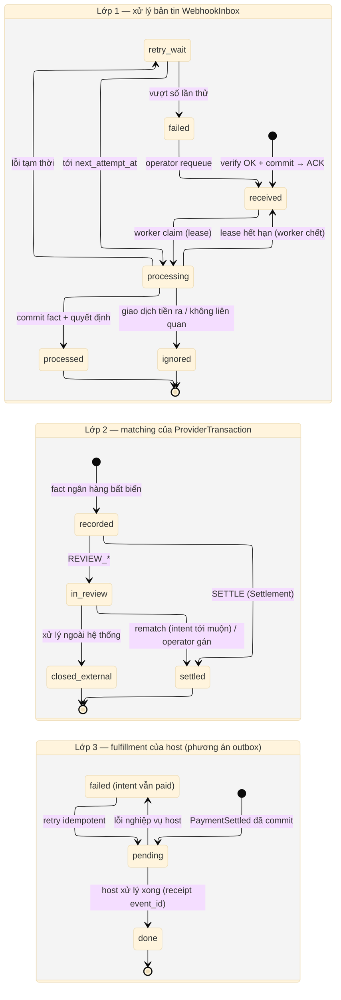

# D10 — Vòng đời Inbox và kết quả matching

[← Mục lục](../readme.md) · [Danh mục sơ đồ](../diagrams.md)

Trạng thái: sơ đồ kiến trúc đề xuất; không phải bằng chứng triển khai. Nguồn Mermaid được chuyển nguyên từ bản thiết kế đã render/kiểm tra ngày 21/09/2026.

Ba lớp tách biệt: xử lý bản tin (WebhookInbox), kết quả matching của giao dịch ngân hàng đã xác thực, và fulfillment nghiệp vụ của host.

- Lease hết hạn đưa bản tin về received để worker khác xử lý lại.
- Fact ngân hàng (recorded) không bị xoá hay sửa khi kết quả matching thay đổi.
- Giao dịch in_review được rematch khi intent tới muộn hoặc operator gán.
- Fulfillment failed chỉ là trạng thái của host; intent vẫn paid.

