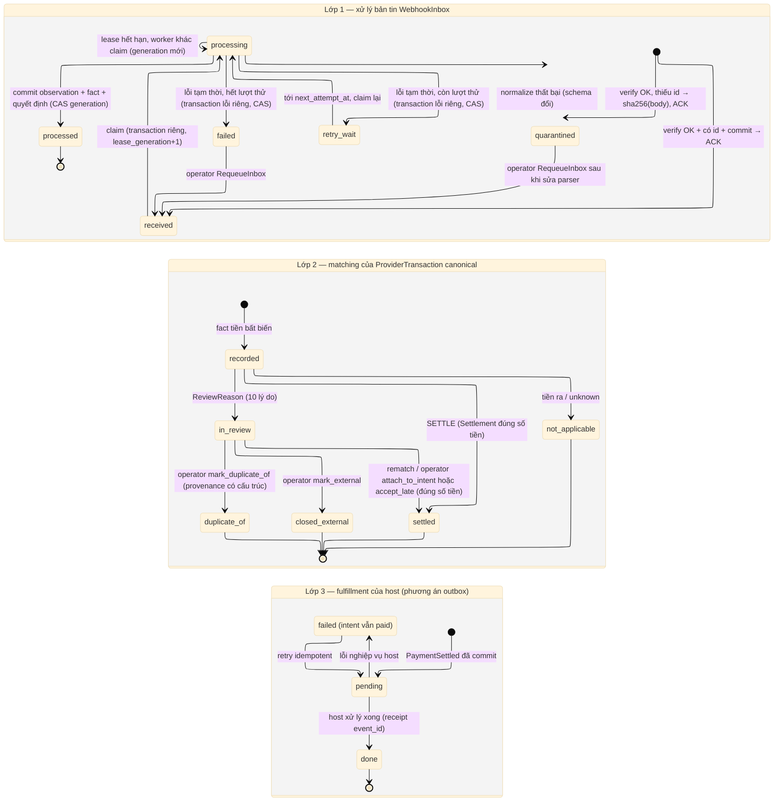

# D10 — Vòng đời Inbox và kết quả matching

[← Mục lục](../readme.md) · [Danh mục sơ đồ](../diagrams.md)

Trạng thái: sơ đồ kiến trúc đã đối chiếu với các delta đã duyệt (22/09/2026); không phải bằng chứng triển khai. Mermaid đã sửa sau lần render 21/09/2026 và chưa render lại.

Ba lớp tách biệt: xử lý bản tin (WebhookInbox), kết quả matching của fact tiền canonical (ProviderTransaction), và fulfillment nghiệp vụ của host.

- Inbox **không còn** trạng thái `ignored`: tiền ra vẫn là fact (`not_applicable` ở lớp 2), inbox luôn `processed` khi fact đã ghi.
- `quarantined`: payload đã qua HMAC nhưng thiếu `id` (khoá `sha256(raw_body)`, vẫn ACK 200) hoặc normalize thất bại vì schema provider đổi. Chỉ rời `quarantined` qua `RequeueInbox` của operator sau khi sửa parser.
- Claim, xử lý, ghi lỗi/retry và thu hồi lease là các transaction tách biệt. Mỗi lần claim tăng `lease_generation`; finalize (thành công hoặc lỗi) là compare-and-set theo generation, nên worker cũ không ghi đè sau khi lease đã bị claim lại. Rollback của transaction xử lý (kể cả lỗi handler cùng UoW) để lại inbox claim lại được.
- Fact ngân hàng (recorded) không bị xoá hay sửa khi kết quả matching thay đổi. `in_review` có thể được rematch (intent tới muộn, `RematchUnbound` sau `bind_receiver`) hoặc operator xử lý; mọi fact có trạng thái kết thúc.
- `duplicate_of`: operator gộp hai canonical lỡ tạo cho cùng một khoản tiền, chỉ khi có provenance có cấu trúc (không dựa vào số tiền/tài khoản/chiều đơn độc).
- Fulfillment failed chỉ là trạng thái của host; intent vẫn paid.

