# D11 — Pipeline xử lý

[← Mục lục](../readme.md) · [Danh mục sơ đồ](../diagrams.md)

Trạng thái: sơ đồ kiến trúc đề xuất; không phải bằng chứng triển khai. Nguồn Mermaid được chuyển nguyên từ bản thiết kế đã render/kiểm tra ngày 21/09/2026.

Sinh bằng compiler của pipeline từ input có provenance (evidence/pipeline-input.json). Mã node P-* nối tới ma trận bằng chứng.

- P-FILTER là hành vi của SePay trước khi gửi: webhook bị lọc bỏ thì không tới package, chỉ đối soát API tìm lại được.
- Nhánh 1 chạy đồng bộ trong request webhook; nhánh 2 và 3 chạy trong worker.
- Fact luôn được ghi trước khi kiểm tra receiver và matching.

```mermaid
---
config:
  theme: base
  fontFamily: Arial, Helvetica, sans-serif
  themeVariables:
    fontFamily: "Arial, Helvetica, sans-serif"
  layout: elk
  flowchart:
    curve: linear
    nodeSpacing: 75
    rankSpacing: 110
    diagramPadding: 40
    wrappingWidth: 220
---
flowchart TB
  subgraph DOMAIN_ingress_0ade4ac5["1. Tiếp nhận (đồng bộ, trước ACK)"]
    direction LR
    P_FILTER_cb1348be[" P-FILTER<br/><b>SePay trích code + lọc webhook</b><br/>mẫu cấp công ty, khớp đầu tiên<br/>chỉ khi có code / theo tiền tố"]
    P_DROPPED_52749871[" P-DROPPED<br/><b>Không có webhook</b><br/>chỉ đối soát API tìm lại"]
    P_LOCATE_8b1d289a[" P-LOCATE<br/><b>Tra connection theo locator</b><br/>Chỉ định tuyến"]
    P_VERIFY_bcecfa56{" P-VERIFY<br/><b>Verify HMAC + timestamp</b><br/>Trên raw body, trước parse"}
    P_INBOX_e78c8a5b[" P-INBOX<br/><b>Ghi WebhookInbox, commit</b><br/>unique connection + event_key<br/>sau đó mới ACK 200"]
    P_REJECT_da64ceff[" P-REJECT<br/><b>401, không ghi inbox</b>"]
  end
  subgraph DOMAIN_processing_670ff335["2. Xử lý (worker, một transaction)"]
    direction LR
    P_CLAIM_95273114[" P-CLAIM<br/><b>Claim inbox</b><br/>lease, SKIP LOCKED"]
    P_RECEIVER_cb29abe7{" P-RECEIVER<br/><b>Guard lõi (trước policy)</b><br/>receiver thuộc connection<br/>chiều tiền vào, tenant khớp"}
    P_FACT_4f31d7b6[" P-FACT<br/><b>Ghi ProviderTransaction</b><br/>unique dedup_key<br/>fact bất biến, cả khi sau đó vào review"]
    P_DECIDE_a757955a{" P-DECIDE<br/><b>MatchingPolicy</b><br/>policy tuỳ biến<br/>không thể cho phép receiver lạ hay tiền ra"}
    P_MATCHREF_e6cdf4b7{" P-MATCHREF<br/><b>Khớp nguyên reference</b><br/>trong project, scope receiver<br/>không có / mơ hồ → review"}
  end
  subgraph DOMAIN_outcome_1e59bfff["3. Kết quả và giao nghiệp vụ"]
    direction LR
    P_SETTLE_46d75079[" P-SETTLE<br/><b>Settlement + intent paid + Outbox</b><br/>cùng commit"]
    P_REVIEW_60a1c87f[" P-REVIEW<br/><b>ReviewCase + Outbox NeedsReview</b><br/>không settle"]
    P_RETRY_fd596347[" P-RETRY<br/><b>retry_wait / failed</b><br/>backoff, cảnh báo"]
    P_HOST_95a0fb69[" P-HOST<br/><b>Host handler</b><br/>cùng UoW hoặc qua outbox"]
  end
  P_FILTER_cb1348be -->|"qua lọc"| P_LOCATE_8b1d289a
  P_FILTER_cb1348be -->|"bị lọc"| P_DROPPED_52749871
  P_LOCATE_8b1d289a -->|"connection active"| P_VERIFY_bcecfa56
  P_VERIFY_bcecfa56 -->|"hợp lệ"| P_INBOX_e78c8a5b
  P_VERIFY_bcecfa56 -->|"sai"| P_REJECT_da64ceff
  P_INBOX_e78c8a5b -->|"worker"| P_CLAIM_95273114
  P_RECEIVER_cb29abe7 -->|"receiver lệch / tiền ra"| P_REVIEW_60a1c87f
  P_DECIDE_a757955a -->|"SETTLE"| P_SETTLE_46d75079
  P_DECIDE_a757955a -->|"REVIEW_*"| P_REVIEW_60a1c87f
  P_CLAIM_95273114 -->|"lỗi tạm"| P_RETRY_fd596347
  P_RETRY_fd596347 -->|"next_attempt_at"| P_CLAIM_95273114
  P_SETTLE_46d75079 -->|"on_settled / event"| P_HOST_95a0fb69
  P_CLAIM_95273114 -->|"normalize"| P_FACT_4f31d7b6
  P_FACT_4f31d7b6 -->|"luôn ghi fact trước"| P_RECEIVER_cb29abe7
  P_RECEIVER_cb29abe7 -->|"đạt"| P_MATCHREF_e6cdf4b7
  P_MATCHREF_e6cdf4b7 -->|"đúng một intent"| P_DECIDE_a757955a
  P_MATCHREF_e6cdf4b7 -->|"không có / mơ hồ"| P_REVIEW_60a1c87f
  classDef screen fill:#064e3b,stroke:#34d399,color:#fff,stroke-width:2px;
  classDef requirement fill:#4c1d95,stroke:#c084fc,color:#fff,stroke-width:2px;
  classDef archetype fill:#0f2942,stroke:#38bdf8,color:#fff,stroke-width:2px;
  classDef decision fill:#422006,stroke:#fbbf24,color:#fff,stroke-width:2px;
  linkStyle default stroke:#64748b,stroke-width:2.4px;
  linkStyle 3,7,11,14,15 stroke:#16a34a,stroke-width:3px;
  linkStyle 0,2,5,12,13 stroke:#0d9488,stroke-width:3px;
  linkStyle 9,10 stroke:#f97316,stroke-width:3px;
  linkStyle 1,4 stroke:#dc2626,stroke-width:3px;
  linkStyle 6,8,16 stroke:#e11d48,stroke-width:3px;
  class P_FILTER_cb1348be screen;
  class P_DROPPED_52749871 screen;
  class P_LOCATE_8b1d289a screen;
  class P_VERIFY_bcecfa56 decision;
  class P_INBOX_e78c8a5b screen;
  class P_CLAIM_95273114 screen;
  class P_RECEIVER_cb29abe7 decision;
  class P_FACT_4f31d7b6 screen;
  class P_DECIDE_a757955a decision;
  class P_SETTLE_46d75079 screen;
  class P_REVIEW_60a1c87f screen;
  class P_RETRY_fd596347 screen;
  class P_REJECT_da64ceff screen;
  class P_HOST_95a0fb69 screen;
  class P_MATCHREF_e6cdf4b7 decision;
```

