# D11 — Pipeline xử lý

[← Mục lục](../readme.md) · [Danh mục sơ đồ](../diagrams.md)

Trạng thái: sơ đồ kiến trúc đã đối chiếu với các delta đã duyệt (22/09/2026); không phải bằng chứng triển khai. Bản gốc sinh bằng compiler pipeline từ evidence/pipeline-input.json; bản này đã sửa tay theo delta (ID node rút gọn) và chưa render lại.

Mã node P-* nối tới ma trận bằng chứng. Thứ tự lõi: **fact → guard → resolver → eligibility → policy → post-check**.

- P-FILTER là hành vi của SePay trước khi gửi: webhook bị lọc bỏ thì không tới package, chỉ đối soát API tìm lại được. Mỗi prefix có tên cần một mục bộ lọc webhook.
- Nhánh 1 chạy đồng bộ trong request webhook; nhánh 2 và 3 chạy trong worker. Ingest chỉ đọc `id` sau HMAC; mọi trường khác chỉ tin sau normalize ở worker.
- Fact luôn được ghi trước khi kiểm tra receiver và matching. Guard xét chiều tiền trước: tiền ra/unknown → `not_applicable` (không review, kể cả receiver chưa bind).
- Không có nhánh nào settle khi số tiền khác intent (U9); `TENANT_MISMATCH` là review + alert + metric (D6).

```mermaid
---
config:
  theme: base
  fontFamily: Arial, Helvetica, sans-serif
  themeVariables:
    fontFamily: "Arial, Helvetica, sans-serif"
  layout: elk
  flowchart:
    curve: linear
    nodeSpacing: 75
    rankSpacing: 110
    diagramPadding: 40
    wrappingWidth: 220
---
flowchart TB
  subgraph ING["1. Tiếp nhận (đồng bộ, trước ACK)"]
    direction LR
    P_FILTER[" P-FILTER<br/><b>SePay trích code + lọc webhook</b><br/>mẫu cấp công ty, khớp đầu tiên<br/>chỉ khi có code / theo từng prefix có tên"]
    P_DROPPED[" P-DROPPED<br/><b>Không có webhook</b><br/>chỉ đối soát API tìm lại"]
    P_LOCATE{" P-LOCATE<br/><b>Tra connection theo locator</b><br/>chỉ định tuyến"}
    P_404[" P-404<br/><b>404 đồng nhất</b><br/>không lộ connection"]
    P_VERIFY{" P-VERIFY<br/><b>Verify HMAC + timestamp</b><br/>trên raw body, trước parse<br/>rồi chỉ đọc id"}
    P_INBOX[" P-INBOX<br/><b>Ghi WebhookInbox, commit</b><br/>unique connection + event_key<br/>sau đó mới ACK 200"]
    P_QUAR[" P-QUARANTINE<br/><b>Inbox quarantined</b><br/>khoá sha256(raw_body), ACK 200, alert"]
    P_REJECT[" P-REJECT<br/><b>401, không ghi inbox</b>"]
  end
  subgraph PROC["2. Xử lý (worker — claim, xử lý, lỗi là transaction riêng, CAS lease_generation)"]
    direction LR
    P_CLAIM[" P-CLAIM<br/><b>Claim inbox</b><br/>lease + generation, SKIP LOCKED"]
    P_FACT[" P-FACT<br/><b>Ghi Observation + ProviderTransaction</b><br/>unique tenant + environment + dedup_key<br/>theo account do payload báo<br/>fact bất biến, cả khi sau đó vào review"]
    P_GUARD{" P-GUARD<br/><b>InvariantGuard (lõi)</b><br/>1. chiều tiền trước<br/>2. receiver thuộc binding, cùng merchant"}
    P_MATCHREF{" P-MATCHREF<br/><b>ReferenceResolver (lõi)</b><br/>khớp nguyên token, unique toàn project"}
    P_ELIG{" P-ELIGIBILITY<br/><b>IntentEligibility (lõi)</b><br/>policy không thấy intent đã đóng"}
    P_DECIDE{" P-DECIDE<br/><b>MatchingPolicy</b><br/>port duy nhất host thay được<br/>chỉ thắt chặt, không nới"}
  end
  subgraph OUT["3. Kết quả và giao nghiệp vụ"]
    direction LR
    P_SETTLE[" P-SETTLE<br/><b>Settlement + intent paid + Outbox</b><br/>cùng commit<br/>CHECK amount = intent_amount"]
    P_NA[" P-NA<br/><b>match_state = not_applicable</b><br/>không review"]
    P_REVIEW[" P-REVIEW<br/><b>ReviewCase + Outbox NeedsReview</b><br/>không settle<br/>TENANT_MISMATCH thêm alert"]
    P_RETRY[" P-RETRY<br/><b>retry_wait / failed</b><br/>backoff, cảnh báo"]
    P_HOST[" P-HOST<br/><b>Host handler</b><br/>cùng UoW hoặc qua outbox"]
  end
  P_FILTER -->|"qua lọc"| P_LOCATE
  P_FILTER -->|"bị lọc"| P_DROPPED
  P_LOCATE -->|"tồn tại, không disabled"| P_VERIFY
  P_LOCATE -->|"lạ / disabled"| P_404
  P_VERIFY -->|"hợp lệ, có id"| P_INBOX
  P_VERIFY -->|"hợp lệ, thiếu id"| P_QUAR
  P_VERIFY -->|"sai"| P_REJECT
  P_INBOX -->|"worker"| P_CLAIM
  P_CLAIM -->|"normalize"| P_FACT
  P_CLAIM -->|"lỗi tạm"| P_RETRY
  P_RETRY -->|"next_attempt_at"| P_CLAIM
  P_FACT -->|"luôn ghi fact trước"| P_GUARD
  P_GUARD -->|"tiền ra / unknown"| P_NA
  P_GUARD -->|"receiver lệch"| P_REVIEW
  P_GUARD -->|"đạt"| P_MATCHREF
  P_MATCHREF -->|"không có / mơ hồ / lệch scope"| P_REVIEW
  P_MATCHREF -->|"đúng một intent"| P_ELIG
  P_ELIG -->|"paid / cancelled / superseded"| P_REVIEW
  P_ELIG -->|"awaiting / expired (is_late)"| P_DECIDE
  P_DECIDE -->|"SETTLE + post-check đúng tiền"| P_SETTLE
  P_DECIDE -->|"AMOUNT_MISMATCH / LATE"| P_REVIEW
  P_SETTLE -->|"on_settled / event"| P_HOST
  linkStyle default stroke:#64748b,stroke-width:2.4px;
  linkStyle 4,11,14,16,18,19 stroke:#16a34a,stroke-width:3px;
  linkStyle 0,2,7,8,21 stroke:#0d9488,stroke-width:3px;
  linkStyle 5,9,10 stroke:#f97316,stroke-width:3px;
  linkStyle 1,3,6 stroke:#dc2626,stroke-width:3px;
  linkStyle 12,13,15,17,20 stroke:#e11d48,stroke-width:3px;
  classDef screen fill:#064e3b,stroke:#34d399,color:#fff,stroke-width:2px;
  classDef decision fill:#422006,stroke:#fbbf24,color:#fff,stroke-width:2px;
  class P_FILTER,P_DROPPED,P_404,P_INBOX,P_QUAR,P_REJECT,P_CLAIM,P_FACT,P_SETTLE,P_NA,P_REVIEW,P_RETRY,P_HOST screen;
  class P_LOCATE,P_VERIFY,P_GUARD,P_MATCHREF,P_ELIG,P_DECIDE decision;
```

