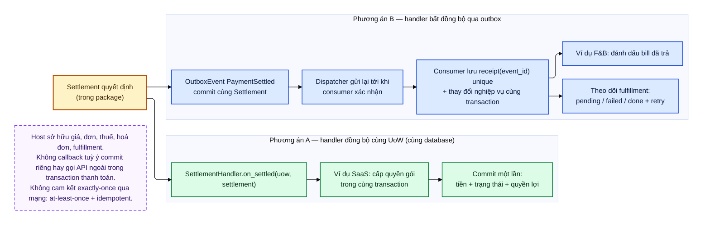

# D12 — Hai phương án tích hợp host

[← Mục lục](../readme.md) · [Danh mục sơ đồ](../diagrams.md)

Trạng thái: sơ đồ kiến trúc đề xuất; không phải bằng chứng triển khai. Nguồn Mermaid được chuyển nguyên từ bản thiết kế đã render/kiểm tra ngày 21/09/2026.

Phương án A giữ nguyên tử tiền + quyền lợi khi host dùng chung database. Phương án B tách bất đồng bộ qua outbox, đổi lại cần theo dõi fulfillment và retry idempotent.

- Không có cam kết exactly-once qua mạng; đảm bảo là at-least-once kèm idempotency ở bên nhận.
- Ví dụ SaaS và F&B chỉ minh hoạ cách tích hợp, không phải thiết kế hệ thống của các dự án đó.

