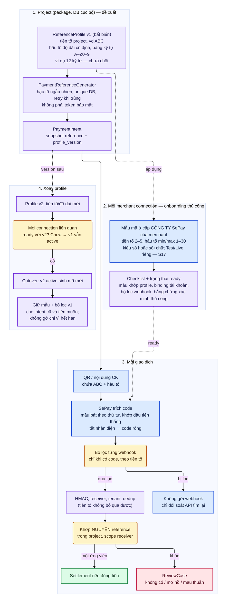

# D13 — Vòng đời mẫu mã thanh toán theo project

[← Mục lục](../readme.md) · [Danh mục sơ đồ](../diagrams.md)

Trạng thái: sơ đồ kiến trúc đề xuất; không phải bằng chứng triển khai. Nguồn Mermaid được chuyển nguyên từ bản thiết kế đã render/kiểm tra ngày 21/09/2026.

Tiền tố đặt theo project. Profile bất biến có version → áp vào mẫu mã cấp công ty SePay của từng merchant (thủ công, có checklist) → sinh mã trong QR → SePay trích code → bộ lọc từng webhook → server xác thực và khớp nguyên reference. Xoay profile giữ nguyên v1 cho tiền muộn.

- Khối màu xanh dương là hành vi SePay đã đọc trong tài liệu (S17); khối màu tím là đề xuất của tài liệu này; khối vàng là điểm quyết định.
- Tiền tố không phải xác thực: HMAC, receiver, tenant và dedup vẫn chạy như cũ.
- Biên của regex SePay (hậu tố dài hơn max, mã nằm lọt trong chuỗi dài) chưa được tài liệu mô tả; phải thử ở Test mode và với nội dung thật của ngân hàng trước production.
- Không có API tự tạo mẫu hay đăng ký mã theo từng intent; package không hứa đồng bộ tự động.

