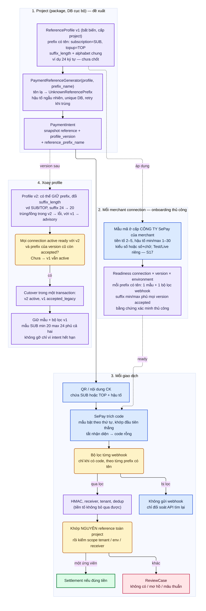

# D13 — Vòng đời mẫu mã thanh toán theo project

[← Mục lục](../readme.md) · [Danh mục sơ đồ](../diagrams.md)

Trạng thái: sơ đồ kiến trúc đã đối chiếu với các delta đã duyệt (22/09/2026); không phải bằng chứng triển khai. Mermaid đã sửa sau lần render 21/09/2026 và chưa render lại.

Prefix cấu hình ở **cấp project** (không bao giờ theo merchant); mỗi version `ReferenceProfile` chứa **nhiều prefix có tên** (D1, vd `subscription` → `SUB`, `topup` → `TOP`) dùng chung `suffix_length` và alphabet. Profile bất biến có version → áp vào mẫu mã cấp công ty SePay của từng merchant (thủ công, có checklist theo từng prefix) → `CreateIntent(prefix_name)` sinh mã trong QR → SePay trích code → bộ lọc từng webhook theo prefix → server xác thực và khớp nguyên reference. Xoay profile giữ nguyên các version cũ còn accepted cho tiền muộn.

- Trong một version: tên prefix không trùng; giá trị prefix không trùng và không lồng nhau (`SUB`/`SUBX`) → lỗi `PrefixOverlap`. Giữa các version còn accepted: **không** từ chối; `check_prefix_overlap` chỉ trả advisory, vì `payment_reference` unique toàn project và khớp nguyên token nên một chuỗi chỉ thuộc một intent/một version.
- Readiness theo **connection × profile version × environment**. Checklist gồm một mục mẫu nhận diện cấp company của SePay và một mục bộ lọc webhook **cho mỗi prefix có tên**; mẫu của một prefix dùng suffix **min = min(L_i), max = max(L_i)** suy ra từ mọi version còn accepted dùng cùng prefix. Readiness bị vô hiệu (về `not_ready`) khi binding, environment, credential, tài khoản hoặc prefix/bộ lọc đổi sau khi đã ready.
- Kích hoạt v2 là **một transaction**: v2 → `active`, v1 → `accepted_legacy`; luôn đúng một active (partial unique). Chỉ kích hoạt khi mọi connection `active` đã ready với v2 và với prefix của mọi version cũ còn accepted.

- Khối màu xanh dương là hành vi SePay đã đọc trong tài liệu (S17); khối màu tím là đề xuất của tài liệu này; khối vàng là điểm quyết định.
- Tiền tố không phải xác thực: HMAC, receiver, tenant và dedup vẫn chạy như cũ.
- Biên của regex SePay (hậu tố dài hơn max, mã nằm lọt trong chuỗi dài) chưa được tài liệu mô tả; phải thử ở Test mode và với nội dung thật của ngân hàng trước production.
- Không có API tự tạo mẫu hay đăng ký mã theo từng intent; package không hứa đồng bộ tự động.

